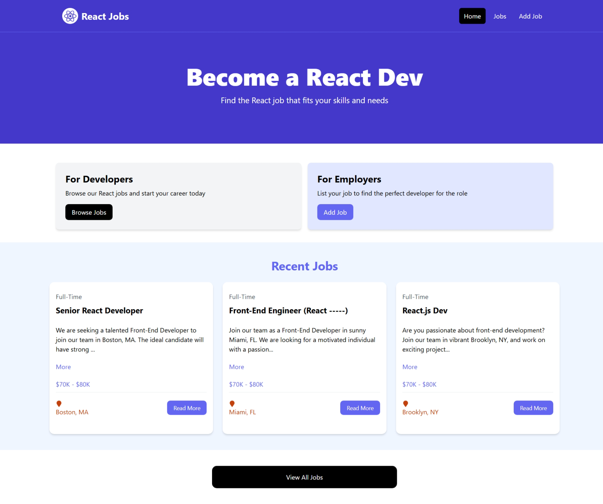
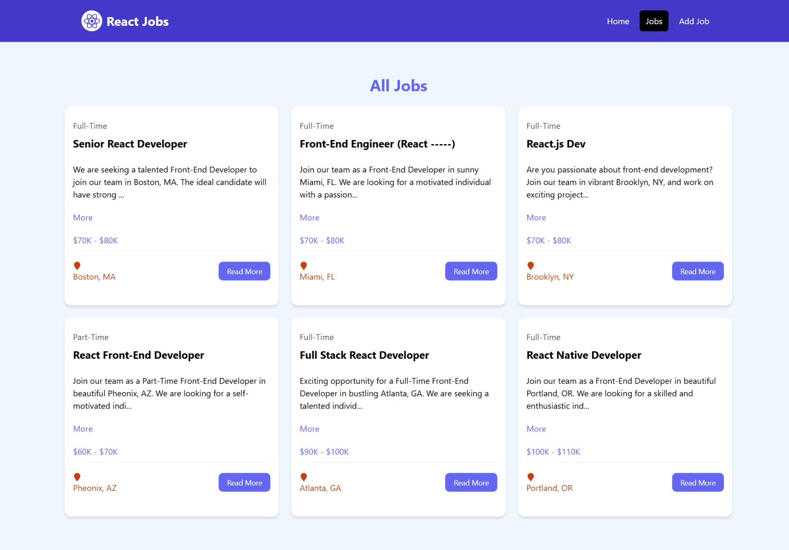
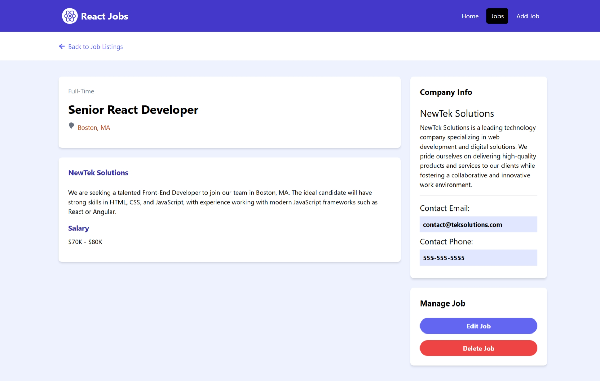

# React Jobs

A modern job listing platform built with React, allowing users to browse, add, edit, and delete job postings focused on React developer positions.

## Features

- **Browse Job Listings**: View all available React developer positions
- **Search and Filter**: Find jobs that match your criteria
- **Job Details**: Comprehensive view of each job posting with company information
- **Create Job Listings**: Post new job opportunities
- **Edit Listings**: Update job details and company information
- **Delete Listings**: Remove outdated job postings
- **Responsive Design**: Mobile-friendly interface using TailwindCSS
- **Toast Notifications**: Real-time feedback when performing actions

## Tech Stack

- **Frontend**: React 19 with JSX
- **State Management**: React Hooks (useState, useEffect)
- **Routing**: React Router v7
- **Styling**: TailwindCSS
- **UI Components**: Custom components with React Icons
- **Notifications**: React Toastify
- **Loading States**: React Spinners
- **Mock Backend**: JSON Server
- **Build Tool**: Vite
- **Linting**: ESLint

## Demo

### Home Page

### Jobs Listing

### Job Details

## API Endpoints

The application uses a JSON Server mock backend with the following endpoints:

- `GET /jobs` - Get all job listings
- `GET /jobs/:id` - Get a specific job listing
- `POST /jobs` - Create a new job listing
- `PUT /jobs/:id` - Update an existing job listing
- `DELETE /jobs/:id` - Delete a job listing

## Features in Detail

### Job Listings
- Browse all job listings on the Jobs page
- View recent job listings on the Home page
- Click on individual jobs to see detailed information

### Job Details
- View comprehensive job information including:
  - Job title and type
  - Location and salary
  - Full job description
  - Company details and contact information

### Adding Jobs
- Fill out the form on the Add Job page
- Provide job details and company information
- Submit to create a new job listing

### Editing Jobs
- Update job information using the Edit Job form
- All fields can be modified and saved

### Deleting Jobs
- Remove job listings through the job details page
- Confirmation prompt before deletion

## Acknowledgments

- Traversy media youtube channel for making a tutorial for beginners.